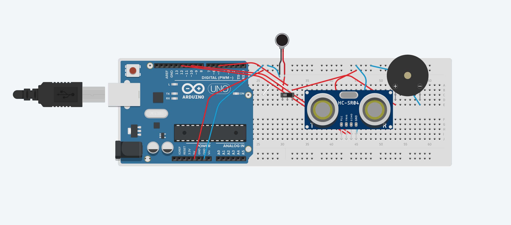

# Third Eye for the Blind
Wearable module that uses an ultrasonic sensor to detect the distance between a person and object. The module has auditory as well as haptic features that alerts the user as they approach an obstacle to prevent collision. As the user approaches an obstacle, the module will vibrate and produce notes with higher tones accordingly. 


| **Engineer** | **School** | **Area of Interest** | **Grade** |
|:--:|:--:|:--:|:--:|
| Valerie W | Westmont | Computer Science | Incoming Senior


  
# Final Milestone

<iframe width="560" height="315" src="https://www.youtube.com/embed/ZdI9HnxM124" title="YouTube video player" frameborder="0" allow="accelerometer; autoplay; clipboard-write; encrypted-media; gyroscope; picture-in-picture; web-share" allowfullscreen></iframe>

<p></p><p>
      
   
   
    
</p>

<p></p>For my final milestone I needed to completely transfer my understandings on a breadboard back onto a perfboard, which in other words, was basically the final project. Unlike a breadboard, I am not able to conveniently stick wires where I need them to be, and instead I need to actually physically angle and solder wires together. Additionally, the perfboard is 5 cm x 3 cm, which is a reasonably small surface area. On my first attempt, treacherously, but almost finally building the module, the wires I soldered began to snap and the wires refused to cooperate in any way. Needing to make a pivotal decision, I committed to restarting the entire module and starting from scratch yet again. On my second attempt, I had a much better concept and skill on how to solder with technique and strategy. Thankfully, I was able to successfully construct a functioning module. Overall, my most memorable achievement was soldering because of how frustrating the experience was. However, despite the frustration, I still managed to solder wires sufficiently to create a full-functioning third eye for the blind. After these three weeks, I realized how important details are in engineering. From hardware to software engineering, you really have to pay attention to every small detail so that your program or project can function properly. Having a solid understanding of what you are actually doing is also super crucial because although we dive head-first into new experiences all the time, returning to the basics and progressing from there makes life easier. With my experience at BlueStamp engineering, I intend to apply my newfound sense of perseverance and interest in engineering to further my journey in the engineering field.

<p></p>Code Added/Altered (Final Milestone):

```c++
const int trigPin = A3;
const int echoPin = A4;
const int switchPin = 5;

void setup() {
  Serial.begin(9600);
  pinMode(trigPin, OUTPUT);
  pinMode(echoPin, INPUT);
  pinMode(switchPin, OUTPUT);
  tone(switchPin, 1000, 2000);
}

void loop() {
  if(cm <= 14 && inches <= 5)
  {
    tone(switchPin, 784);
    digitalWrite(switchPin, HIGH);
    delay(1000);
    Serial.println("in condition 1");
  }
    else if(cm <= 24 && inches <= 10)
    {
       tone(switchPin, 698);
       digitalWrite(switchPin, HIGH);
       delay(1000);
       Serial.println("in condition 2");
    }
    else if(cm <= 34 && inches <= 15)
    {
      tone(switchPin, 659);
      digitalWrite(switchPin, LOW);
      delay(1000);
      Serial.println("in condition 3");
    }
    else if(cm <= 44 && inches <= 20)
    {
      tone(switchPin, 587);
      digitalWrite(switchPin, LOW);
      delay(1000);
      Serial.println("in condition 4");
    }
    else if(cm <= 55 && inches <= 25)
    {
      tone(switchPin, 523);
      digitalWrite(switchPin, LOW);
      delay(1000);
      Serial.println("in condition 5");
    }
    else if(cm <= 65 && inches <= 30)
    {
      tone(switchPin, 494);
      digitalWrite(switchPin, LOW);
      delay(1000);
      Serial.println("in condition 6");
    }
  else
  {
    noTone(switchPin);
    digitalWrite(switchPin, LOW);
  }
  delay(100);
```


# Second Milestone

<iframe width="560" height="315" src="https://www.youtube.com/embed/QIRJv3blXDk" title="YouTube video player" frameborder="0" allow="accelerometer; autoplay; clipboard-write; encrypted-media; gyroscope; picture-in-picture; web-share" allowfullscreen></iframe>

<p></p>For my second milestone I wanted to further improve my code by allowing the module to produce different notes depending on the distance between the object and sensor. On my first attempt I had parameter errors in my code, and the buzzer was unable to perform different tones, persistently playing only one tone. After realizing the error, I changed the parameters in my code so that the buzzer was able to produce the different tones relative to the distance sensed between the user and obstacle.

<p></p>Code Added/Altered (Second Milestone):

```c++
const int trigPin = 12;
const int echoPin = 10;
const int switchPin = 5;

void setup() {
  Serial.begin(9600);
  pinMode(trigPin, OUTPUT);
  pinMode(echoPin, INPUT);
  pinMode(switchPin, OUTPUT);
  tone(switchPin, 1000, 2000);
}

void loop() {
  if(cm <= 14 && inches <= 5)
  {
    tone(switchPin, 784);
    digitalWrite(switchPin, HIGH);
    delay(1000);
    Serial.println("in condition 1");
  }
    else if(cm <= 24 && inches <= 10)
    {
       tone(switchPin, 698);
       delay(1000);
       Serial.println("in condition 2");
    }
    else if(cm <= 34 && inches <= 15)
    {
      tone(switchPin, 659);
      delay(1000);
      Serial.println("in condition 3");
    }
    else if(cm <= 44 && inches <= 20)
    {
      tone(switchPin, 587);
      delay(1000);
      Serial.println("in condition 4");
    }
    else if(cm <= 55 && inches <= 25)
    {
      tone(switchPin, 523);
      delay(1000);
      Serial.println("in condition 5");
    }
    else if(cm <= 65 && inches <= 30)
    {
      tone(switchPin, 494);
      delay(1000);
      Serial.println("in condition 6");
    }
  else
  {
    noTone(switchPin);
    digitalWrite(switchPin, LOW);
  }
  delay(100);
```

# First Milestone

<iframe width="560" height="315" src="https://www.youtube.com/embed/_SxStWX_lAc" title="YouTube video player" frameborder="0" allow="accelerometer; autoplay; clipboard-write; encrypted-media; gyroscope; picture-in-picture; web-share" allowfullscreen></iframe>

<iframe width="560" height="315" src="https://www.youtube.com/embed/ViQxMdRthm0" title="YouTube video player" frameborder="0" allow="accelerometer; autoplay; clipboard-write; encrypted-media; gyroscope; picture-in-picture; web-share" allowfullscreen></iframe>

<p></p><p>
  
  
  
</p> 


<p></p>For my first milestone I attempted to construct one module of my project straight on a perfboard, but failed astronomically on both understanding how everything installs and connects together. So, I decided to transfer my work from a perfboard to a breadboard to achieve a deeper understanding of each component and how they should connect all together. I watched a Youtube explanation on the functionality of breadboards, and my program director taught me how to solder wires with different cores. After gaining useful knowledge, I was able to apply the insight into successfully building a functioning module onto a breadboard. Besides the hardware engineering, through Arduino, I was able to utilize the Ping example program to trigger the vibrating motor and buzzer. However, the buzzer was unable to make any sound except a faint clicking. I did some research on the difference in coding different types of buzzers, and after research, I was able to alter my code so that the buzzer was able to make the desired sound properly. 

<p></p>Code Added/Altered (First Milestone):

```c++
const int trigPin = 12;
const int echoPin = 10;
const int switchPin = 5;

void setup() {
  Serial.begin(9600);
  pinMode(trigPin, OUTPUT);
  pinMode(echoPin, INPUT);
  pinMode(switchPin, OUTPUT);
  tone(switchPin, 1000, 2000);
}

void loop() {
  if(cm < 7 && inches < 4)
  {
    tone(switchPin, 784);
    digitalWrite(switchPin, HIGH);
  }
  else
  {
    noTone(switchPin);
    digitalWrite(switchPin, LOW);
  }
  delay(100);
```


# Schematics 



<p></p><p>
  
  
  
  
</p>


# Base Code
```c++
const int pingPin = 7;

void setup() {
  Serial.begin(9600);
}

void loop() {
  long duration, inches, cm;

  pinMode(pingPin, OUTPUT);
  digitalWrite(pingPin, LOW);
  delayMicroseconds(2);
  digitalWrite(pingPin, HIGH);
  delayMicroseconds(5);
  digitalWrite(pingPin, LOW);

  pinMode(pingPin, INPUT);
  duration = pulseIn(pingPin, HIGH);

  inches = microsecondsToInches(duration);
  cm = microsecondsToCentimeters(duration);

  Serial.print(inches);
  Serial.print("in, ");
  Serial.print(cm);
  Serial.print("cm");
  Serial.println();

  delay(100);
}

long microsecondsToInches(long microseconds) {
  return microseconds / 74 / 2;
}

long microsecondsToCentimeters(long microseconds) {
  return microseconds / 29 / 2;
}
```

# Materials Used
| **material** | **price** | **link** |
|:--:|:--:|:--:|
| safety glasses | $2.19 | <a href="https://www.amazon.com/MCR-Safety-CL010-Checklite-Glasses/dp/B009SRXSUA/ref=sr_1_4crid=2Y64BGOBG6GJH&keywords=mcr+safety+cl110+checklite+safety+glasses+with+clear+frame&qid=1688655520&sprefix=mcr+safety+cl110+checklite+safety+glasses+with+clear+frame%2Caps%2C144&sr=8-4"> link </a> 
solderless breadboard | $9.98 | <a href="https://www.amazon.com/EL-CP-003-Breadboard-Solderless-DistributionConnecting/dp/B01EV6LJ7G/ref=sr_1_3crid=1ELWX0HNETCH&keywords=elegoo+3pcs+breadboard+830+point+solderless+prototype+pcb+board+kit&qid=1688655674&sprefix=elegoo+3+pcs+brea%2Caps%2C166&sr=8-3"> link </a> 
breadboard jumper wires assorted kit | $13.35 | <a href="https://www.amazon.com/QISF-Breadboard-PreformedAntiStaticElectronics/dp/B088WNZXFQ/ref=sr_1_5crid=SX3Y99PVBCPD&keywords=breadboard+jumper+wire+assorted+kit&qid=1688655766&sprefix=breadboard+jumper+wire+assorted+kit%2Caps%2C129&sr=8-5"> link </a> 
precision wire stripper | $5.50 | <a href="https://www.amazon.com/Eclipse-CP-301G-ProsKit-Precision-Stripper/dp/B005JVJDIA/ref=sr_1_2?crid=1EBVRQ45Q1ML9&keywords=eclipse+tools+cp-301g+pro%27skit+precision+wire+stripper%2C+30-20+awg&qid=1688655846&sprefix=eclipse+tools+%2Caps%2C151&sr=8-2"> link </a> 
gorilla dual temp mini hot glue gun kit | $17.99 | <a href="https://www.amazon.com/Arduino-A000066-ARDUINO-UNO-R3/dp/B008GRTSV6/](https://www.amazon.com/Gorilla-8401509-Hot-Glue-Sticks/dp/B07K791YRP/ref=sr_1_1?crid=2MEANWQH01O3G&keywords=gorilla+dual+temp+mini+hot+glue+gun&qid=1689609320&sprefix=gorilla+dual+temp%2Caps%2C198&sr=8-1)"> link </a> 
circuit board breadboard | $6.99 | <a href="https://www.amazon.com/Arduino-A000066-ARDUINO-UNO-R3/dp/B008GRTSV6/](https://www.amazon.com/HiLetgo-Finished-Prototype-Circuit-Breadboard/dp/B00FXHXT80/ref=sr_1_3?crid=ANK8O51Y30Q2&keywords=hiletgo+20+pcs+solder+finished+prototype+PCB+for+diy+5x7&qid=1689609444&sprefix=hiletgo+20+pcs+solder+finished+prototype+pcb+for+diy+5x7%2Caps%2C154&sr=8-3)"> link </a> 
female pin headers | $6.99 | <a href="https://www.amazon.com/Arduino-A000066-ARDUINO-UNO-R3/dp/B008GRTSV6/](https://www.amazon.com/Yohii-Female-Headers-2-54mm-Single/dp/B07PLBC2GT/ref=sr_1_3?crid=1PVFU2AMYA9S3&keywords=dahszhi%2Bfemale%2Bpin%2Bheaders%2B2.54mm&qid=1689609521&sprefix=dahszhi%2Bfemale%2Bpin%2Bheaders%2B2.54mm%2Caps%2C144&sr=8-3&th=1)"> link </a> 
VELCRO one-wrap roll | $7.98 | <a href="https://www.amazon.com/Arduino-A000066-ARDUINO-UNO-R3/dp/B008GRTSV6/](https://www.amazon.com/VELCRO-Brand-ONE-WRAP-Double-Sided-Multi-Purpose/dp/B000078CUB/ref=sr_1_3?crid=1RLVMU74HRSLJ&keywords=velcro+one+wrap+roll+double+sided%2C+self+gripping&qid=1689609636&sprefix=velcro+one+wrap+roll+double+sided%2C+self+gripping%2Caps%2C155&sr=8-3)"> link </a> 
ultrasonic sensor module for arduino | $9.99 | <a href="https://www.amazon.com/Arduino-A000066-ARDUINO-UNO-R3/dp/B008GRTSV6/](https://www.amazon.com/WWZMDiB-Ultrasonic-Sensor-Raspberry-HC-SR04/dp/B0C166NX3Z/ref=sr_1_8?crid=385710WVR1GS6&keywords=ultrasonic+sensor+module+for+arduino&qid=1689618009&sprefix=ultrasonic+sensor+module+for+arduino%2Caps%2C164&sr=8-8)"> link </a> 
electronic alarm passive buzzer sounder | $7.99 | <a href="https://www.amazon.com/Arduino-A000066-ARDUINO-UNO-R3/dp/B008GRTSV6/](https://www.amazon.com/a15091400ux0103-Electronic-Mounting-Passive-Sounder/dp/B018I1WBNQ/ref=sr_1_1?crid=1AS2F4MZNZK6Y&keywords=uxcell+electronic+alarm+PCB+panel&qid=1689618282&sprefix=uxcell+electronic+alarm+pcb+panel%2Caps%2C159&sr=8-1)"> link </a>
toggle switch vertical slide switch | $5.39 | <a href="https://www.amazon.com/Arduino-A000066-ARDUINO-UNO-R3/dp/B008GRTSV6/](https://www.amazon.com/HiLetgo-SS-12D00-Toggle-Switch-Vertical/dp/B07RTJDW27/ref=sr_1_8?crid=L0HK00P6RPZF&keywords=hiletgo+20+pcs+toggle+switch+vertical&qid=1689618351&sprefix=hiletgo+20+pcs+toggle+switch+vertical%2Caps%2C154&sr=8-8)"> link </a> 
pitch single row pin header strip | $5.49 | <a href="https://www.amazon.com/Arduino-A000066-ARDUINO-UNO-R3/dp/B008GRTSV6/](https://www.amazon.com/HiLetgo-20pcs-2-54mm-Single-Header/dp/B07R5QDL8D/ref=sr_1_1_sspa?crid=DDFUU6L5KWD2&keywords=hiletgo+20+pc+pitch+single+row+pin+header+strip&qid=1689618421&sprefix=hiletgo+20+pc+pitch+single+row+pin+header+stri%2Caps%2C218&sr=8-1-spons&sp_csd=d2lkZ2V0TmFtZT1zcF9hdGY&psc=1)"> link </a> 
LED dlode lights assortment kit | $5.88 | <a href="https://www.amazon.com/Arduino-A000066-ARDUINO-UNO-R3/dp/B008GRTSV6/](https://www.amazon.com/Diffused-Lighting-Electronics-Components-Emitting/dp/B01C3ZZT2I/ref=sr_1_3?crid=2ZHLWCX7TX7NB&keywords=chanzon+60+pcs+6+colors+x+10+pcs+5mm+led+diode+lights&qid=1689618481&sprefix=chanzon+60+pc%2Caps%2C197&sr=8-3)"> link </a> 
arduino micro with headers | $17.95 | <a href="https://www.amazon.com/Arduino-A000066-ARDUINO-UNO-R3/dp/B008GRTSV6/](https://www.amazon.com/Arduino-Micro-Headers-A000053-Controller/dp/B00AFY2S56/ref=sr_1_3?crid=2RLU2IGONQXSS&keywords=arduino+micro+with+headers&qid=1689618608&sprefix=arduino+micro+wit%2Caps%2C189&sr=8-3)"> link </a> |
digital multimeter | $12.49 | <a href="https://www.amazon.com/Arduino-A000066-ARDUINO-UNO-R3/dp/B008GRTSV6/](https://www.amazon.com/Etekcity-Multimeter-MSR-R500-Electronic-Multimeters/dp/B01N9QW620/ref=sr_1_1_sspa?crid=2E8YMTD5RKZD5&keywords=etekcity%2Bdigital%2Bmultimeter&qid=1688655187&sprefix=etekcity%2Bdigital%2Bmultimeter%2Caps%2C166&sr=8-1-spons&sp_csd=d2lkZ2V0TmFtZT1zcF9hdGY&th=1)"> link </a>
portable charging bank | $17.99 | <a href="https://www.amazon.com/Arduino-A000066-ARDUINO-UNO-R3/dp/B008GRTSV6/](https://www.amazon.com/Anker-PowerCore-Ultra-Compact-High-Speed-Technology/dp/B01CU1EC6Y/ref=asc_df_B01CU1EC6Y/?tag=hyprod-20&linkCode=df0&hvadid=312111908612&hvpos=&hvnetw=g&hvrand=18094504964760026445&hvpone=&hvptwo=&hvqmt=&hvdev=c&hvdvcmdl=&hvlocint=&hvlocphy=9032183&hvtargid=pla-523807968135&psc=1)"> link </a> 
soldering iron kit | $19.99 | <a href="https://www.amazon.com/Arduino-A000066-ARDUINO-UNO-R3/dp/B008GRTSV6/](https://www.amazon.com/Soldering-Iron-Kit-Temperature-Desoldering/dp/B07S61WT16/ref=sr_1_6?crid=28E849CUD7Q9G&keywords=soldering+iron+kit+soldering+iron+60+w&qid=1689619086&sprefix=soldering+iron+kit+soldering+iron+60+w%2Caps%2C163&sr=8-6)"> link </a> 
